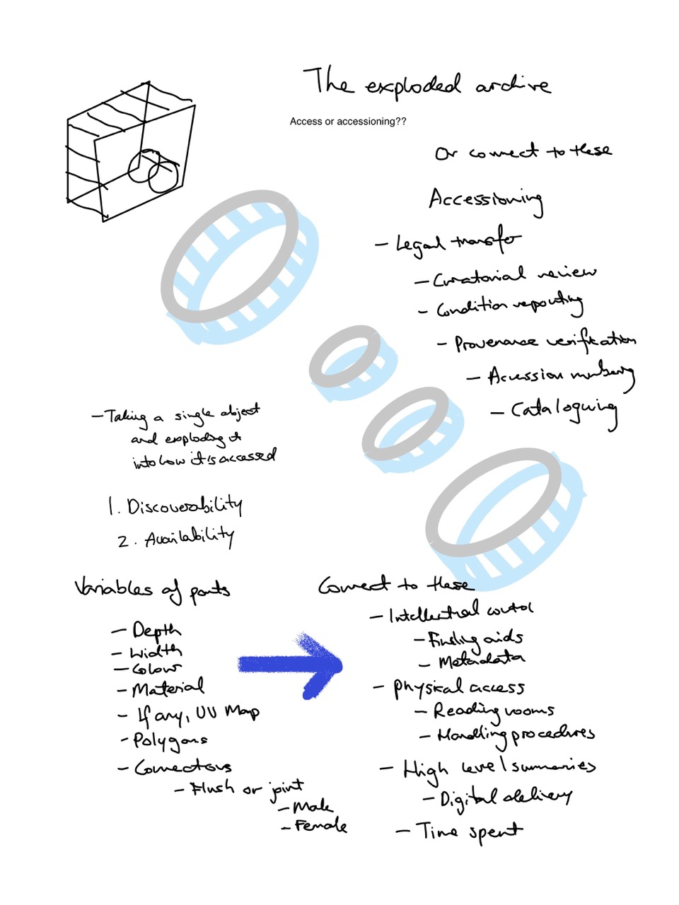
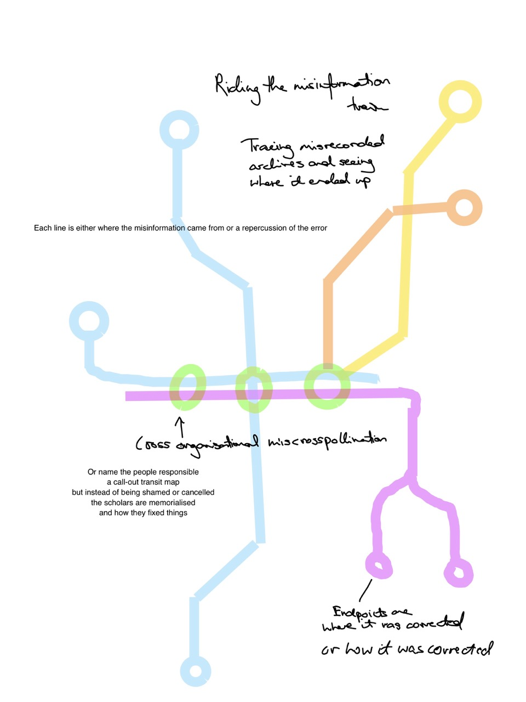
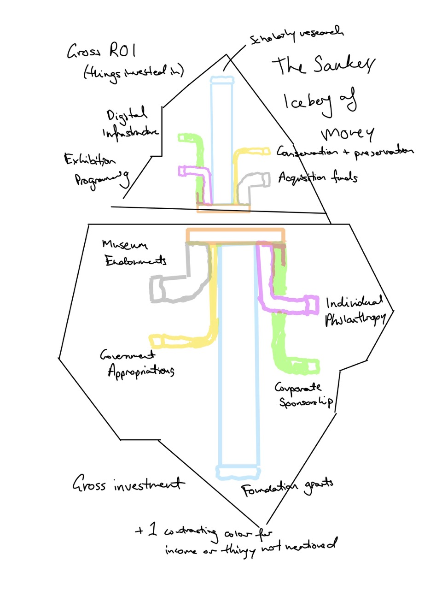

# Project 01 Smithsonian Concept Sketches

---

## The Exploded Archive

- **Questions:** How is an object accessed/accessioned? (Will commit to which question after seeing what's at hand.)
- **Quantitative aspects of data used:**
- *Accession records:*
    - legal transfer: count of deeds/agreements; date of transfer
    - curatorial review: number of reviews; staff-hours
    - condition reporting: number of condition reports; count of damages noted
    - provenance verification: number of ownership links traced; gaps in the chain
    - accession numbering: count of accession numbers issued; date assigned
    - cataloguing: number of catalogue records/fields completed
  - *Access records:*
    - finding aids: number of finding aids; pages
    - metadata: number of metadata fields; % completeness
    - reading rooms: number of on-site visits/appointments
    - handling procedures: number of handling events; count of restrictions
    - digital delivery: number of downloads/views; files served
    - time spent: hours or days
- **Properties used:** visual variables of the 3D-model parts — depth, width, colour, material, UV map (if any), polygons, connectors (flush or joint, male, female).
- **Visualization type used:** Exploded-view drawing ([datavizproject.com/data-type/exploded-view-drawing](https://datavizproject.com/data-type/exploded-view-drawing/)).

---

## Riding the Misinformation Train

- **Questions:** Inspired by git/GitHub blame, who introduced an error into a museum record, when, how did it propagate across recordkeeping, and how was it resolved?
- **Quantitative aspects of data used:** record version/edit history, the erroneous fields (name, date, maker, provenance), the blame attribution on each change (who/when), propagation across systems, and correction events.
- **Properties used:** line colour = system/source being blamed; station = a record version; interchange ring = cross-organisational propagation; terminal ring = resolution/correction; position = order, not distance.
- **Visualization type used:** Transit map ([datavizproject.com/data-type/transit-map](https://datavizproject.com/data-type/transit-map/)).

---

## The Sankey Iceberg of Money

- **Questions:** Where does the museum's money come from, what does it become, and how much sits below the waterline the public never sees?
- **Quantitative aspects of data used:** US dollars per fiscal year by source (government appropriation *PERCENTAGE* / *DOLLAR AMOUNT*, endowments, individual philanthropy, corporate sponsorship, foundation grants) and by expenditure (scholarly research, digital infrastructure, exhibition programming, conservation + preservation, acquisition funds).
- **Properties used:** band width = dollar amount; colour = source/destination (+1 contrasting colour for income source or anything unnamed); vertical position above/below the orange waterline = spent vs. raised.
- **Visualization type used:** Sankey diagram ([datavizproject.com/data-type/sankey-diagram](https://datavizproject.com/data-type/sankey-diagram/)).
